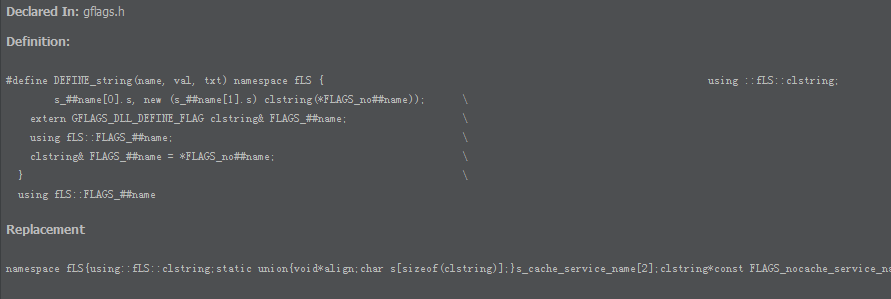

CLion-MacroFormatter
====================

A CLion plugin that shows formatted macro expansion in the code documentation panel.

Requirements
============

For better utilization of this plugin, install clang-format. Usually, you just need to install clang.

Installation
==========

 - [jetbrains plugin repository](https://plugins.jetbrains.com/plugin/7674)

Usage
=====

 - Install this plugin  
 - Go to "Settings -> MacroFormatter", choose which formatter to use
   - **IDE Builtin**: use CLion built-in formatter. *Not recommended*, due to poor performance.
   - **Clang format**: use clang-format for better format.
     - set the path of clang-format (preferred over the IDE-builtin formatter), optionally with additional parameters. For example: `/usr/bin/clang-format -style=Google`
 - Put your cursor on a C/C++ macro
 - Use View | Quick Documentation or the corresponding keyboard shortcut (by default: **Ctrl+Q** on Windows/Linux and **F1** on Mac) with the cursor focused on a macro.

Screenshots
===========

#### Before :(

#### After :)

Change log
==========

  - 2019.3 Update to get compatible with CLion 2019.3; Add support for IDE Builtin formatter.
  - 0.4.1 Set default code style to Google.
  - 0.4.0 Keep compatiblity with the latest CLion eap. 
  - 0.3.0 Warn the user if clang-format is not found. 
  - 0.2.1 Small bugfix. 
  - 0.2 Switch to clang-format.
  - 0.1 Initial release